# Smart College Attendance System

A modern attendance tracking system using the **MERN stack** and **Raspberry Pi** hardware.

It allows students to check in using OCR, keypad, or RFID, and gives teachers full control over attendance, grades, and announcements via a secure web portal.

---

## ✅ Features

- Scan student IDs using OCR  
- Manual entry via keypad if student doesn't have their ID  
- Admin override using RFID  
- Real-time LCD feedback for check-in  
- Teachers and students access web portal  
- Auto-attendance grading based on percentage  
- Secure login with email or Google  
- Role-based access (admin, teacher, student)  
- Announcements and materials per subject  
- Excel export of grades and attendance  

---

## 🖼️ Screenshots

> **Images & Videos**

### 🖼️ UI Screens

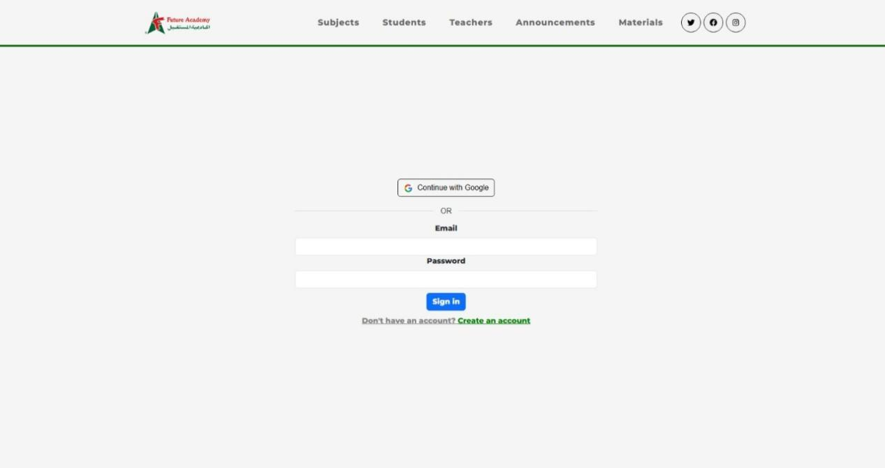  
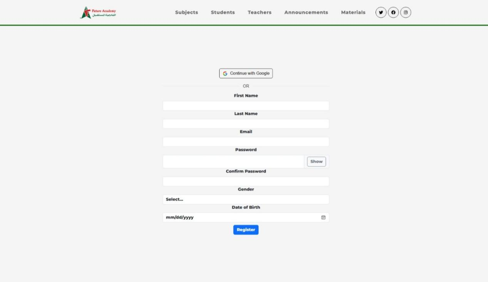  
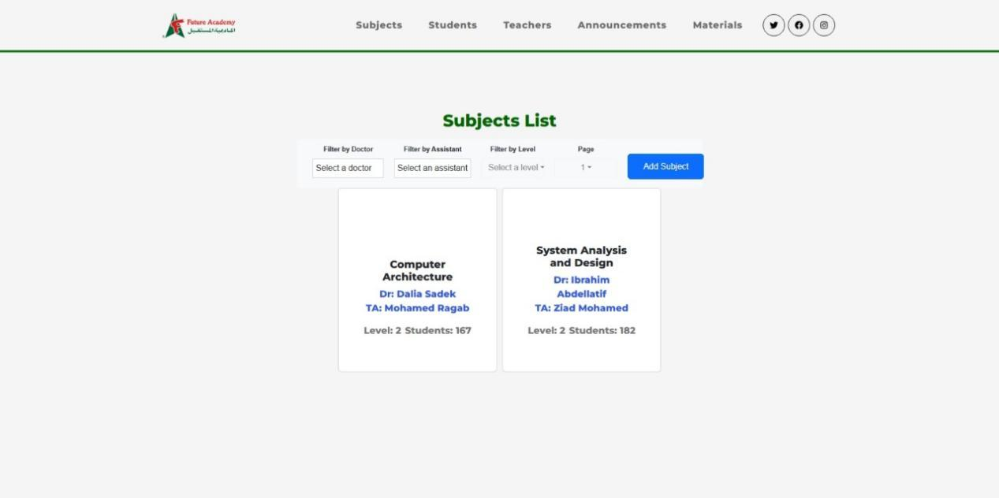  
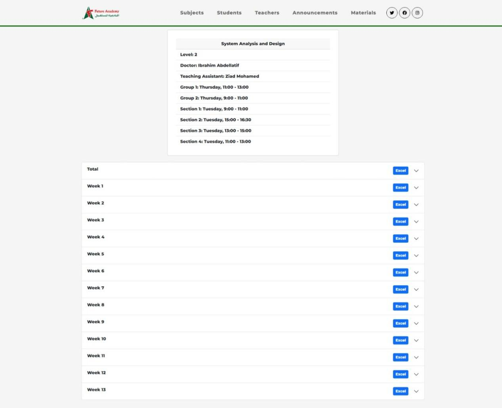  
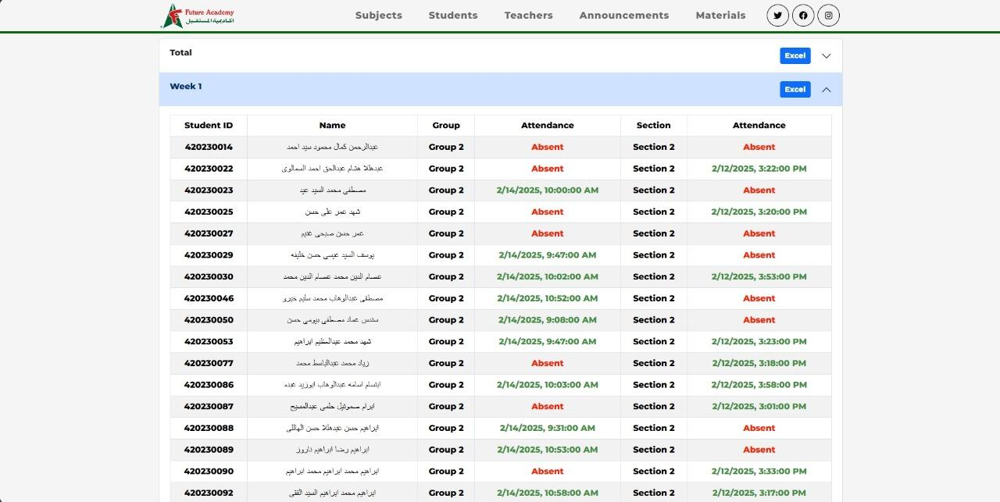  
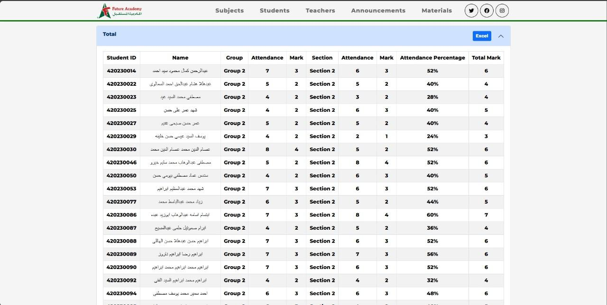  
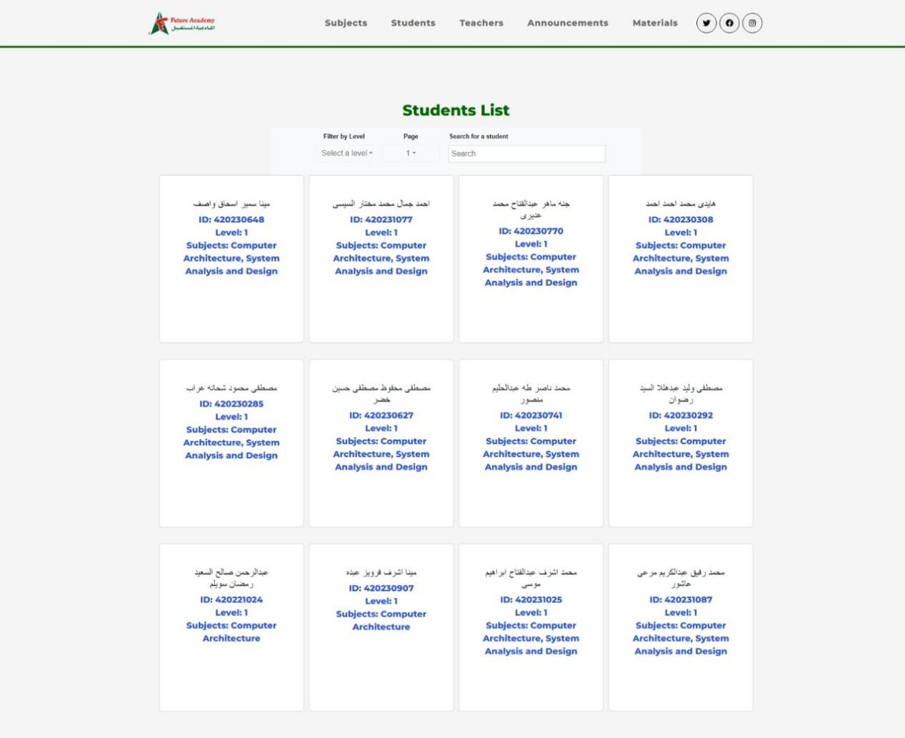  
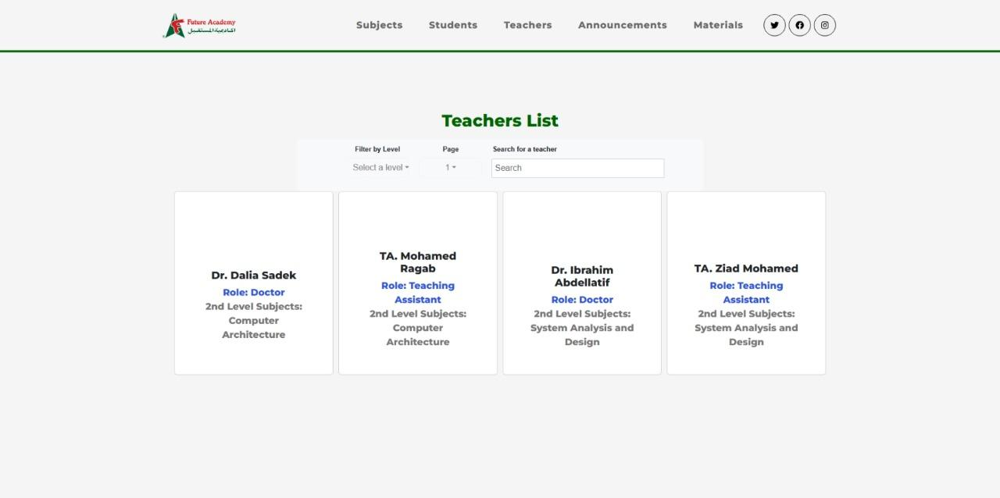  
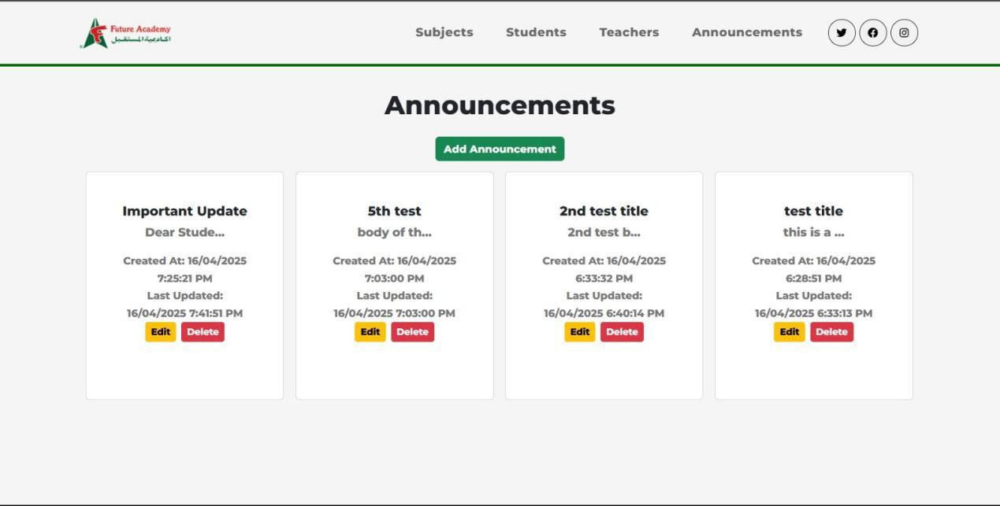  
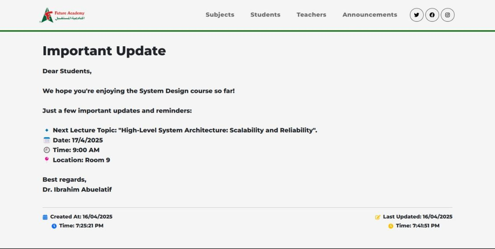  
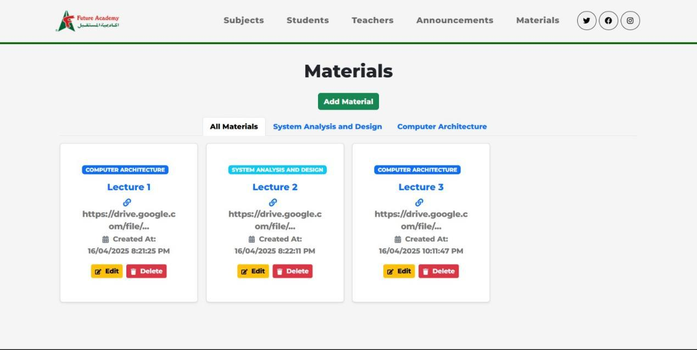

---

## 🛠️ Tech Stack

- **Frontend**: React.js  
- **Backend**: Node.js, Express.js  
- **Database**: MongoDB  
- **Auth**: Passport OAuth Strategy
- **Hardware**: Raspberry Pi, Keypad, RFID Scanner, LCD Display  
- **OCR**: Tesseract.js

---

### 📹 Demo Videos
https://github.com/user-attachments/assets/03798e87-249c-4aa4-8347-67253656a8c5
