# Smart College Attendance System

A team-built college attendance prototype with a React/TypeScript client and an Express/MongoDB API. The source includes subject schedules, student records, attendance processing, OCR, staff accounts, announcements, materials, and attendance spreadsheet exports.

## Architecture

- `client/`: Vite/React screens, authenticated API requests, attendance views.
- `server/controllers/` and `server/src/services/`: HTTP handlers and attendance/OCR/WebSocket logic.
- `server/models/`: Mongoose schemas; Passport handles local and optional Google login.
- Hardware endpoints use a configured camera API key. Browser routes and WebSocket connections use signed sessions; attendance updates notify the client to refresh its records.

## Run locally

Use Node.js 22 and MongoDB. Copy `server/.env.example` to an ignored `server/.env`. Set `MONGODB_URI`, a random `ACCESS_TOKEN_SECRET` of at least 32 characters, and a distinct `CAMERA_API_KEY`. Google OAuth and Cloudinary require your own provider configuration if used.

```sh
cd server
npm ci
npm test
npm start
```

In a second terminal:

```sh
cd client
npm ci
npm run build
npm run dev
```

The default API is `http://localhost:3001`; the development client runs on port 5173. `VITE_BACKEND_URL` configures the shared API client. The root Compose configuration is an alternative; supply the values documented in `.env.example` before `docker compose up --build`.

Staff workflows use management, doctor, and teaching-assistant roles.

## Testing

Run `npm test` in `server/` and `npm run build` in `client/`. To include database integration tests, set `MONGODB_TEST_URI` to an isolated test database before running the server suite. The tests create and delete their own test records.

The repository contains the web application and API. Device firmware is outside this repository.

## Screenshots

### UI Screens

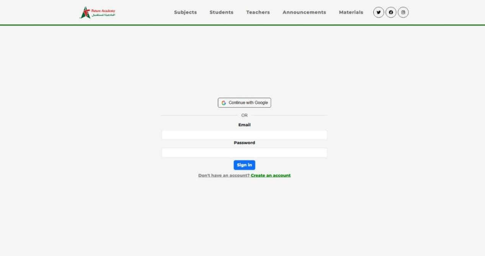  
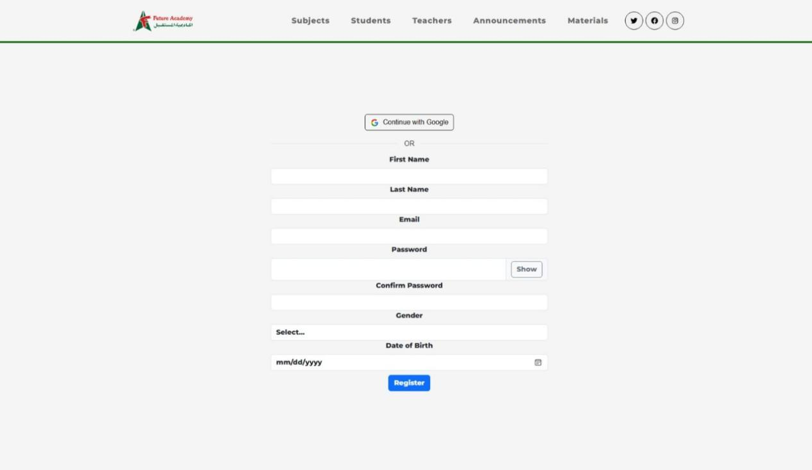  
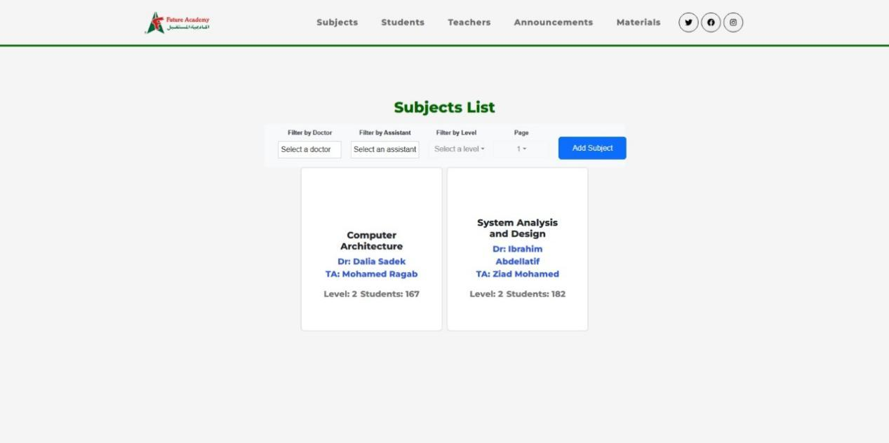  
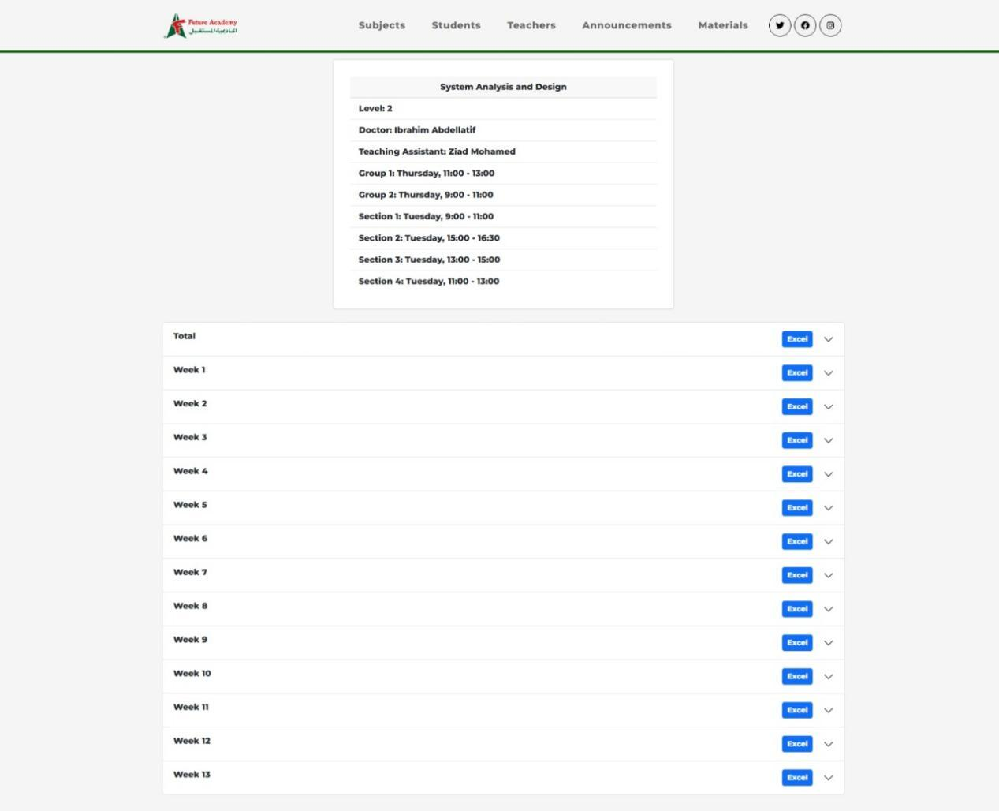  
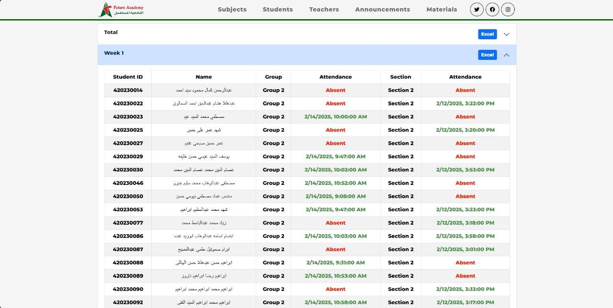  
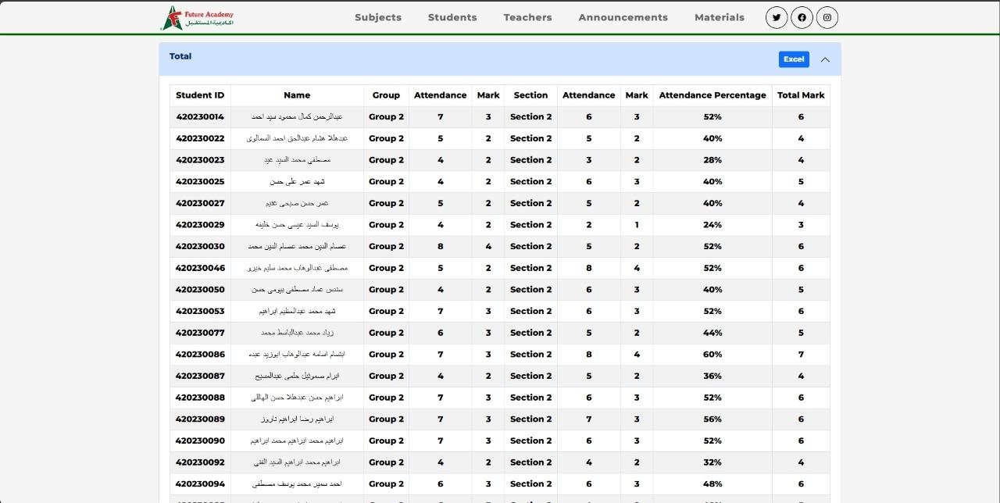  
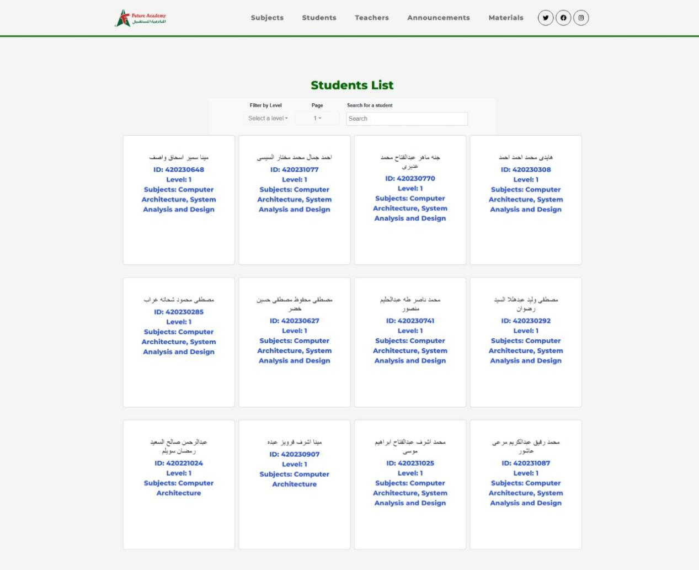  
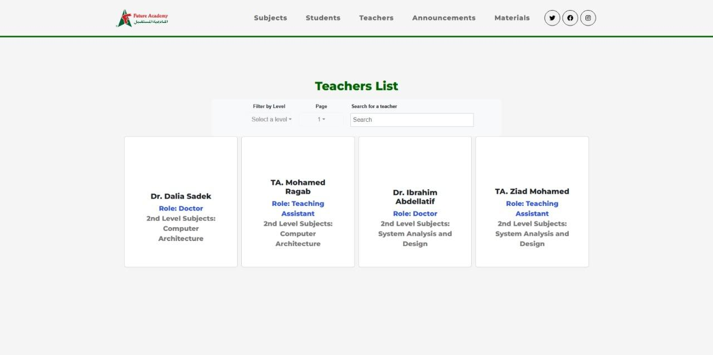  
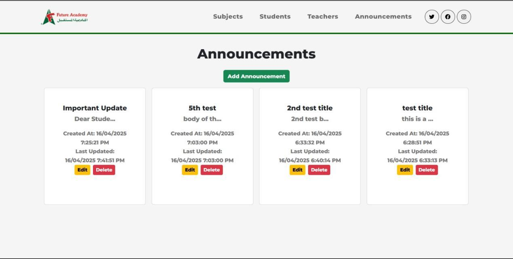  
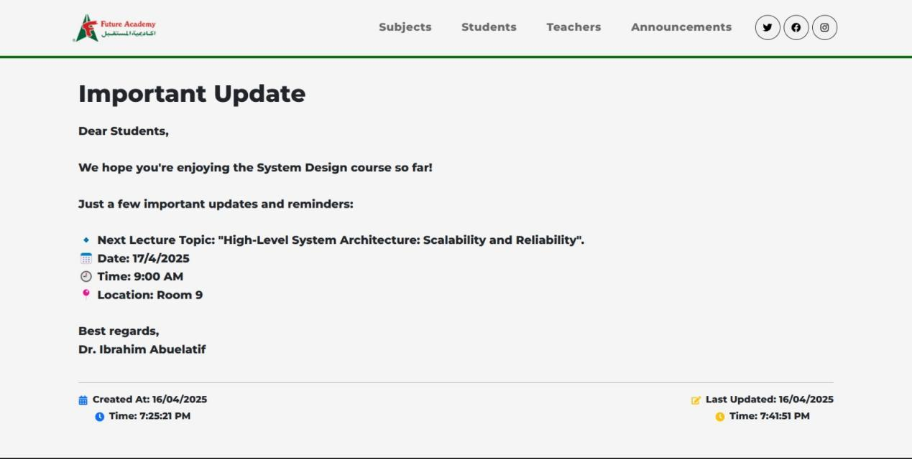  
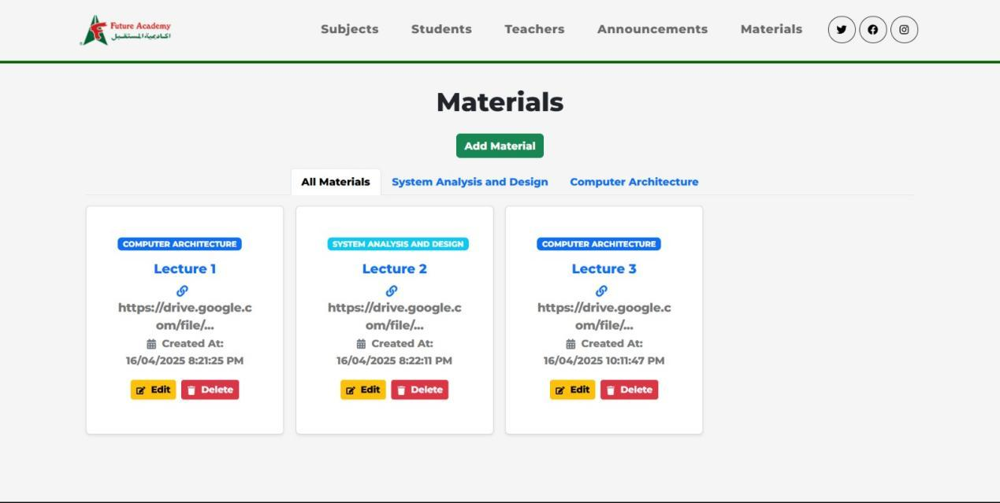


## Demo

https://github.com/user-attachments/assets/03798e87-249c-4aa4-8347-67253656a8c5
